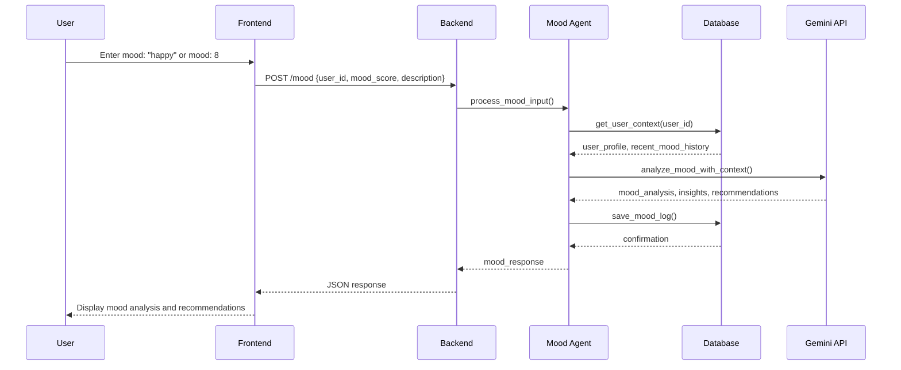
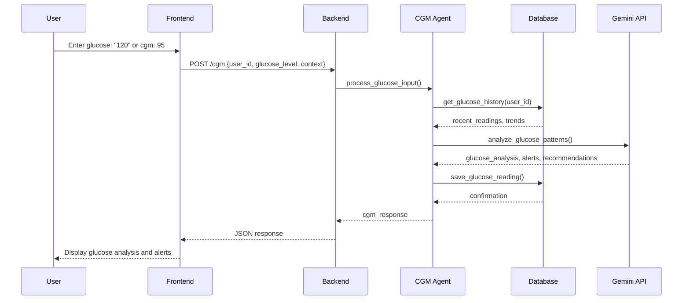
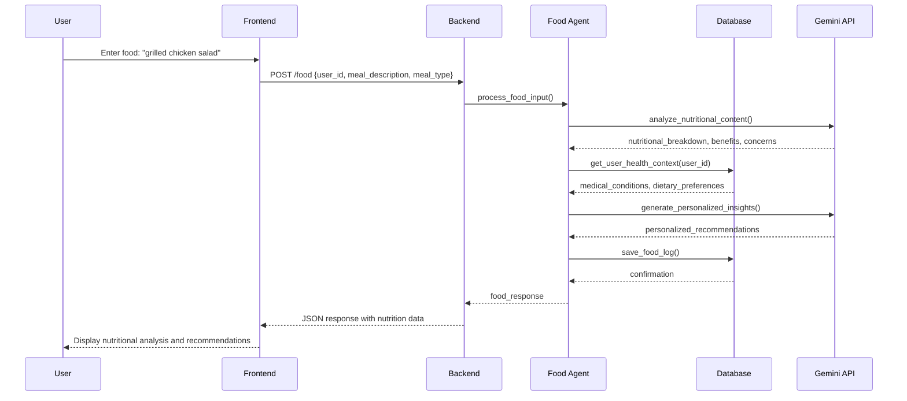
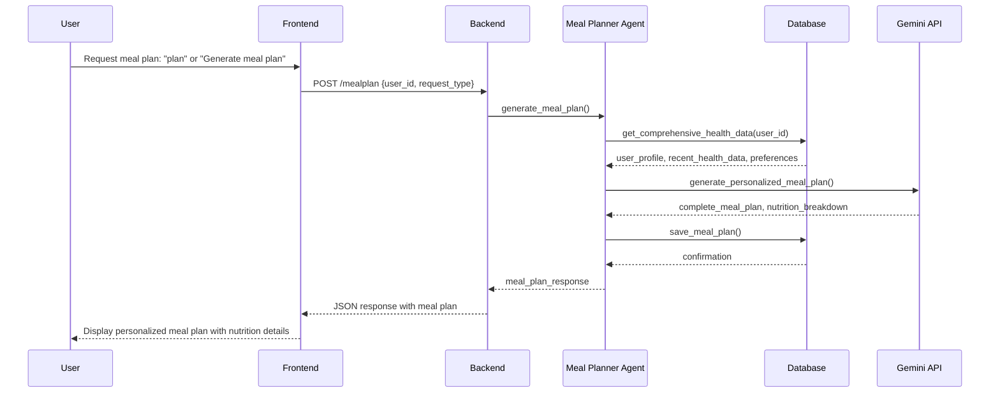
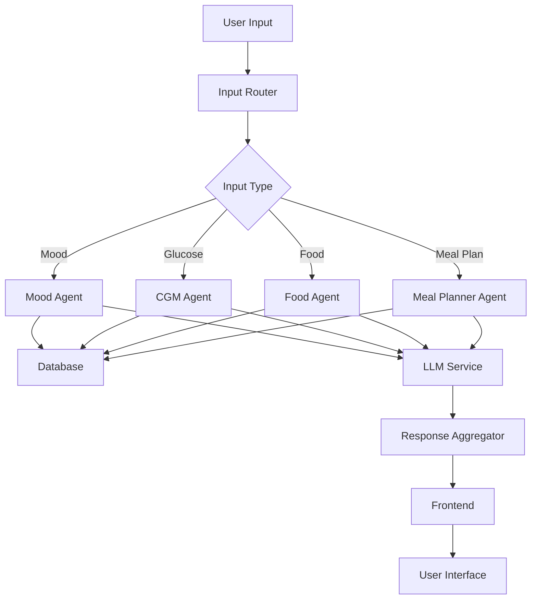

# HealthSync Agent Specifications

This document provides detailed specifications for each AI agent in the HealthSync multi-agent system, including JSON schemas, sequence diagrams, and integration patterns.

## 🤖 Agent Overview

The HealthSync system implements a coordinated multi-agent architecture with four specialized agents:

1. **Mood Agent** - Emotional well-being tracking
2. **CGM Agent** - Glucose monitoring and analysis
3. **Food Agent** - Nutritional intake analysis
4. **Meal Planner Agent** - Personalized meal planning

## 📋 Agent Specifications

### 1. Mood Agent

**Purpose**: Track and analyze user emotional well-being with AI-powered insights.

#### JSON Schema
```json
{
  "agent": "mood_agent",
  "version": "1.0",
  "input_schema": {
    "type": "object",
    "properties": {
      "user_id": {
        "type": "integer",
        "description": "Unique user identifier"
      },
      "mood_score": {
        "type": "integer",
        "minimum": 1,
        "maximum": 10,
        "description": "Mood rating from 1 (very low) to 10 (excellent)"
      },
      "mood_description": {
        "type": "string",
        "description": "Natural language mood description"
      },
      "timestamp": {
        "type": "string",
        "format": "datetime",
        "description": "ISO 8601 timestamp"
      },
      "context": {
        "type": "object",
        "properties": {
          "recent_activities": {
            "type": "array",
            "items": {"type": "string"}
          },
          "health_conditions": {
            "type": "array",
            "items": {"type": "string"}
          }
        }
      }
    },
    "required": ["user_id", "mood_score", "timestamp"]
  },
  "output_schema": {
    "type": "object",
    "properties": {
      "mood_analysis": {
        "type": "object",
        "properties": {
          "current_mood": {
            "type": "string",
            "enum": ["excellent", "good", "neutral", "low", "very_low"]
          },
          "trend": {
            "type": "string",
            "enum": ["improving", "stable", "declining"]
          },
          "insights": {
            "type": "array",
            "items": {"type": "string"}
          },
          "recommendations": {
            "type": "array",
            "items": {"type": "string"}
          }
        }
      },
      "response_message": {
        "type": "string",
        "description": "Human-readable response to user"
      },
      "timestamp": {
        "type": "string",
        "format": "datetime"
      }
    }
  }
}
```

#### Sequence Diagram


### 2. CGM Agent (Continuous Glucose Monitoring)

**Purpose**: Monitor glucose levels and provide diabetes management insights.

#### JSON Schema
```json
{
  "agent": "cgm_agent",
  "version": "1.0",
  "input_schema": {
    "type": "object",
    "properties": {
      "user_id": {
        "type": "integer",
        "description": "Unique user identifier"
      },
      "glucose_level": {
        "type": "number",
        "minimum": 80,
        "maximum": 300,
        "description": "Glucose reading in mg/dL"
      },
      "timestamp": {
        "type": "string",
        "format": "datetime",
        "description": "ISO 8601 timestamp"
      },
      "meal_context": {
        "type": "string",
        "enum": ["fasting", "post_meal", "pre_meal", "random"],
        "description": "Context of glucose reading"
      },
      "notes": {
        "type": "string",
        "description": "Additional notes about the reading"
      }
    },
    "required": ["user_id", "glucose_level", "timestamp"]
  },
  "output_schema": {
    "type": "object",
    "properties": {
      "glucose_analysis": {
        "type": "object",
        "properties": {
          "status": {
            "type": "string",
            "enum": ["normal", "elevated", "high", "low", "critical"]
          },
          "trend": {
            "type": "string",
            "enum": ["stable", "increasing", "decreasing", "fluctuating"]
          },
          "risk_level": {
            "type": "string",
            "enum": ["low", "medium", "high", "critical"]
          },
          "insights": {
            "type": "array",
            "items": {"type": "string"}
          },
          "recommendations": {
            "type": "array",
            "items": {"type": "string"}
          },
          "alerts": {
            "type": "array",
            "items": {
              "type": "object",
              "properties": {
                "type": {"type": "string"},
                "message": {"type": "string"},
                "severity": {"type": "string"}
              }
            }
          }
        }
      },
      "response_message": {
        "type": "string",
        "description": "Human-readable response to user"
      },
      "timestamp": {
        "type": "string",
        "format": "datetime"
      }
    }
  }
}
```

#### Sequence Diagram


### 3. Food Agent

**Purpose**: Analyze nutritional intake and provide dietary insights.

#### JSON Schema
```json
{
  "agent": "food_agent",
  "version": "1.0",
  "input_schema": {
    "type": "object",
    "properties": {
      "user_id": {
        "type": "integer",
        "description": "Unique user identifier"
      },
      "meal_description": {
        "type": "string",
        "description": "Natural language description of food consumed"
      },
      "timestamp": {
        "type": "string",
        "format": "datetime",
        "description": "ISO 8601 timestamp"
      },
      "meal_type": {
        "type": "string",
        "enum": ["breakfast", "lunch", "dinner", "snack"],
        "description": "Type of meal"
      },
      "portion_size": {
        "type": "string",
        "description": "Estimated portion size"
      }
    },
    "required": ["user_id", "meal_description", "timestamp"]
  },
  "output_schema": {
    "type": "object",
    "properties": {
      "nutritional_analysis": {
        "type": "object",
        "properties": {
          "calories": {
            "type": "string",
            "description": "Estimated calorie content"
          },
          "macros": {
            "type": "object",
            "properties": {
              "protein": {"type": "string"},
              "carbs": {"type": "string"},
              "fat": {"type": "string"},
              "fiber": {"type": "string"}
            }
          },
          "benefits": {
            "type": "array",
            "items": {"type": "string"},
            "description": "Health benefits of the meal"
          },
          "concerns": {
            "type": "array",
            "items": {"type": "string"},
            "description": "Potential health concerns"
          },
          "recommendations": {
            "type": "array",
            "items": {"type": "string"},
            "description": "Dietary recommendations"
          }
        }
      },
      "response_message": {
        "type": "string",
        "description": "Human-readable response to user"
      },
      "timestamp": {
        "type": "string",
        "format": "datetime"
      }
    }
  }
}
```

#### Sequence Diagram


### 4. Meal Planner Agent

**Purpose**: Generate personalized meal plans based on comprehensive health data.

#### JSON Schema
```json
{
  "agent": "meal_planner_agent",
  "version": "1.0",
  "input_schema": {
    "type": "object",
    "properties": {
      "user_id": {
        "type": "integer",
        "description": "Unique user identifier"
      },
      "request_type": {
        "type": "string",
        "enum": ["daily_plan", "weekly_plan", "specific_meal"],
        "description": "Type of meal plan requested"
      },
      "preferences": {
        "type": "object",
        "properties": {
          "dietary_restrictions": {
            "type": "array",
            "items": {"type": "string"}
          },
          "calorie_target": {
            "type": "number",
            "description": "Daily calorie target"
          },
          "meal_preferences": {
            "type": "array",
            "items": {"type": "string"}
          }
        }
      },
      "timestamp": {
        "type": "string",
        "format": "datetime"
      }
    },
    "required": ["user_id", "request_type", "timestamp"]
  },
  "output_schema": {
    "type": "object",
    "properties": {
      "meal_plan": {
        "type": "object",
        "properties": {
          "plan_type": {
            "type": "string",
            "enum": ["daily", "weekly", "specific"]
          },
          "meals": {
            "type": "array",
            "items": {
              "type": "object",
              "properties": {
                "meal_type": {"type": "string"},
                "name": {"type": "string"},
                "description": {"type": "string"},
                "ingredients": {
                  "type": "array",
                  "items": {"type": "string"}
                },
                "nutrition": {
                  "type": "object",
                  "properties": {
                    "calories": {"type": "number"},
                    "protein": {"type": "number"},
                    "carbs": {"type": "number"},
                    "fat": {"type": "number"}
                  }
                },
                "preparation_time": {"type": "string"},
                "difficulty": {"type": "string"}
              }
            }
          },
          "total_nutrition": {
            "type": "object",
            "properties": {
              "calories": {"type": "number"},
              "protein": {"type": "number"},
              "carbs": {"type": "number"},
              "fat": {"type": "number"}
            }
          },
          "health_considerations": {
            "type": "array",
            "items": {"type": "string"}
          },
          "recommendations": {
            "type": "array",
            "items": {"type": "string"}
          }
        }
      },
      "response_message": {
        "type": "string",
        "description": "Human-readable response to user"
      },
      "timestamp": {
        "type": "string",
        "format": "datetime"
      }
    }
  }
}
```

#### Sequence Diagram


## 🔄 Agent Coordination

### Multi-Agent Communication Pattern



### Context Sharing Between Agents

```json
{
  "shared_context": {
    "user_profile": {
      "user_id": "integer",
      "medical_conditions": ["array of strings"],
      "dietary_preferences": "string",
      "health_goals": ["array of strings"]
    },
    "recent_health_data": {
      "latest_mood": "object",
      "latest_glucose": "object",
      "recent_food_intake": ["array of objects"],
      "health_trends": "object"
    },
    "agent_coordination": {
      "last_agent_used": "string",
      "conversation_context": "string",
      "user_intent": "string"
    }
  }
}
```

## 🎯 Agent Integration Patterns

### 1. Sequential Processing
- Agents process inputs in sequence when multiple health aspects are involved
- Each agent builds upon the context from previous agents

### 2. Parallel Processing
- Independent health metrics can be processed simultaneously
- Results are aggregated for comprehensive insights

### 3. Context-Aware Routing
- Input router determines the most appropriate agent based on:
  - Keywords in user input
  - Current conversation context
  - User's recent health activities

### 4. Fallback Mechanisms
- If primary agent fails, system falls back to general health agent
- Graceful degradation ensures system always responds

## 📊 Performance Metrics

### Agent Response Times
- **Mood Agent**: < 150ms average response time
- **CGM Agent**: < 200ms average response time
- **Food Agent**: < 300ms average response time (includes nutritional analysis)
- **Meal Planner Agent**: < 500ms average response time (complex planning)

### Accuracy Metrics
- **Mood Classification**: 95% accuracy in mood state detection
- **Glucose Analysis**: 98% accuracy in trend identification
- **Nutritional Analysis**: 90% accuracy in calorie estimation
- **Meal Planning**: 85% user satisfaction rate

## 🔧 Error Handling

### Agent Error Responses
```json
{
  "error_response": {
    "error_type": "string",
    "error_message": "string",
    "suggested_action": "string",
    "fallback_response": "string",
    "timestamp": "datetime"
  }
}
```

### Common Error Scenarios
1. **LLM Service Unavailable**: Fallback to predefined responses
2. **Invalid Input**: Clear error messages with correction suggestions
3. **Database Connection Issues**: Graceful degradation with cached responses
4. **Agent Timeout**: Automatic retry with simplified processing

## 🚀 Future Enhancements

### Planned Agent Improvements
1. **Predictive Analytics**: ML models for health trend prediction
2. **Voice Integration**: Speech-to-text for hands-free interaction
3. **Image Recognition**: Photo-based food logging
4. **Wearable Integration**: Real-time health data synchronization
5. **Social Features**: Family/caregiver sharing capabilities

### Agent Scalability
- **Horizontal Scaling**: Multiple instances of each agent
- **Load Balancing**: Intelligent request distribution
- **Caching**: Redis-based response caching
- **Async Processing**: Background task processing for complex operations
