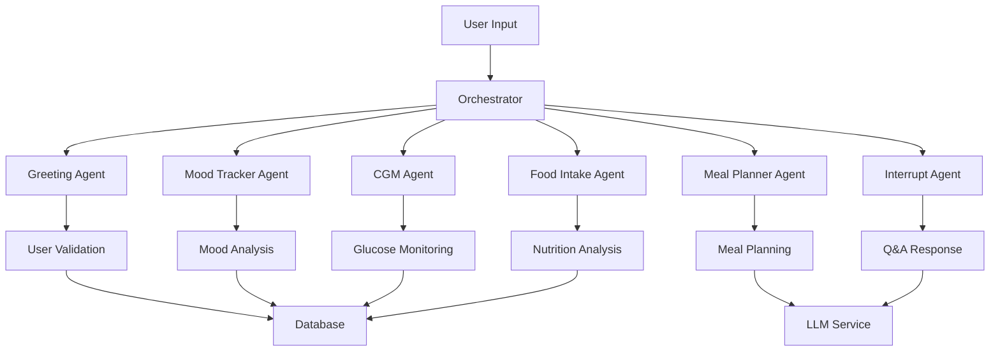

# HealthSync Agent Specifications

## Overview
This document provides detailed specifications for all six agents in the HealthSync multi-agent system, implemented using the Agno framework.

## Agent Architecture



## Agent Specifications

### 1. Greeting Agent

**Purpose**: Validates user ID and provides personalized greeting

**Inputs**:
- `user_id` (int): User ID to validate (1-100)

**Outputs**:
- `success` (bool): Validation status
- `message` (str): Personalized greeting
- `user_info` (dict): User profile data
- `next_step` (str): Suggested next action

**Business Logic**:
1. Validate user ID against database
2. Retrieve user profile (name, city, dietary preference, medical conditions)
3. Generate personalized greeting with health context
4. Suggest mood tracking as next step

**Error Handling**:
- Invalid user ID: Prompt for valid ID (1-100)
- Database error: Graceful fallback message

### 2. Mood Tracker Agent

**Purpose**: Captures and analyzes user mood patterns

**Inputs**:
- `user_id` (int): User ID
- `mood` (str): Mood label (happy, sad, excited, tired, etc.)

**Outputs**:
- `success` (bool): Logging status
- `message` (str): Encouraging response
- `mood_score` (int): Numerical score (1-5)
- `rolling_average` (float): 7-day average

**Valid Moods**:
```json
{
  "happy": 5, "excited": 5, "content": 4, "calm": 4,
  "neutral": 3, "tired": 2, "sad": 2, "stressed": 1,
  "anxious": 1, "angry": 1
}
```

**Business Logic**:
1. Validate mood against predefined list
2. Convert to numerical score
3. Store with timestamp
4. Calculate rolling 7-day average
5. Provide encouraging feedback based on score
6. Suggest CGM logging as next step

### 3. CGM Agent

**Purpose**: Logs glucose readings with health alerts

**Inputs**:
- `user_id` (int): User ID
- `glucose_level` (float): Reading in mg/dL (40-400 range)

**Outputs**:
- `success` (bool): Logging status
- `message` (str): Health feedback
- `status` (str): Alert level
- `alert_level` (str): Risk classification
- `average_reading` (float): 7-day average

**Alert Levels**:
- **Critical Low**: < 70 mg/dL
- **Low**: 70-79 mg/dL
- **Normal**: 80-140 mg/dL
- **Elevated**: 141-180 mg/dL
- **High**: 181-250 mg/dL
- **Critical High**: > 250 mg/dL

**Business Logic**:
1. Validate glucose reading range
2. Classify into alert level
3. Store with timestamp
4. Provide specific health guidance
5. Calculate 7-day average
6. Suggest food logging as next step

### 4. Food Intake Agent

**Purpose**: Records meals with AI-powered nutritional analysis

**Inputs**:
- `user_id` (int): User ID
- `meal_description` (str): Free-text meal description
- `timestamp` (str, optional): Custom timestamp

**Outputs**:
- `success` (bool): Logging status
- `message` (str): Confirmation with analysis
- `nutrition_analysis` (dict): LLM-generated breakdown
- `meal_description` (str): Original input

**Business Logic**:
1. Validate meal description
2. Generate timestamp if not provided
3. Analyze nutrition using LLM prompt:
   - Primary macronutrients
   - Estimated calories
   - Health benefits/concerns
   - Meal timing recommendations
4. Store structured data
5. Suggest meal planning as next step

### 5. Meal Planner Agent

**Purpose**: Generates personalized meal plans using comprehensive health data

**Inputs**:
- `user_id` (int): User ID
- `preferences` (dict, optional): Dietary preference overrides

**Outputs**:
- `success` (bool): Generation status
- `meal_plan` (dict): Structured 3-meal plan
- `health_insights` (str): Personalized guidance
- `user_context` (dict): Full user profile

**Context Gathering**:
1. User profile (dietary preference, medical conditions)
2. Latest CGM reading (24h window)
3. Recent mood (24h window)
4. Recent food entries (last 3 meals)

**LLM Prompt Structure**:
```
Create a personalized daily meal plan for [Name] with:
- Dietary Preference: [vegetarian/vegan/mixed]
- Medical Conditions: [conditions]
- Latest Glucose: [reading] mg/dL
- Recent Mood: [mood] (score: [score]/5)
- Recent Meals: [descriptions]

Return JSON with breakfast/lunch/dinner including macros.
```

### 6. Interrupt Agent (General Q&A)

**Purpose**: Handles general queries and routes back to main flow

**Inputs**:
- `user_id` (int): User ID
- `query` (str): Free-form question
- `current_context` (str): Current flow step

**Outputs**:
- `success` (bool): Response status
- `message` (str): Answer with routing
- `query_type` (str): Classification
- `routing_suggestion` (str): Next step guidance

**Query Classification**:
- **Emergency**: Contains emergency keywords
- **Health Question**: Medical/health related
- **Information Request**: How/what/why questions
- **Help Request**: Support/assistance
- **General Query**: Other questions

**Emergency Handling**:
Immediate detection of keywords: "emergency", "urgent", "911", "chest pain", "heart attack", etc.
Response includes emergency contact information and immediate action guidance.

## Conversation Flow

```
1. Greeting Agent    → Validates user, provides welcome
2. Mood Tracker     → Captures mood, calculates trends
3. CGM Agent        → Logs glucose, provides alerts
4. Food Intake      → Records meals, analyzes nutrition
5. Meal Planner     → Generates personalized plan
6. Interrupt Agent  → Available at any point for Q&A
```

## Database Schema

### Users Table
```sql
CREATE TABLE users (
    id INTEGER PRIMARY KEY,
    first_name TEXT,
    last_name TEXT,
    city TEXT,
    dietary_preference TEXT,
    medical_conditions TEXT,
    physical_limitations TEXT
);
```

### Mood Logs
```sql
CREATE TABLE mood_logs (
    id INTEGER PRIMARY KEY AUTOINCREMENT,
    user_id INTEGER,
    mood TEXT,
    score INTEGER,
    timestamp TEXT,
    FOREIGN KEY (user_id) REFERENCES users (id)
);
```

### CGM Logs
```sql
CREATE TABLE cgm_logs (
    id INTEGER PRIMARY KEY AUTOINCREMENT,
    user_id INTEGER,
    glucose_level REAL,
    alert_level TEXT,
    timestamp TEXT,
    FOREIGN KEY (user_id) REFERENCES users (id)
);
```

### Food Logs
```sql
CREATE TABLE food_logs (
    id INTEGER PRIMARY KEY AUTOINCREMENT,
    user_id INTEGER,
    meal_description TEXT,
    nutrition_analysis TEXT,
    timestamp TEXT,
    FOREIGN KEY (user_id) REFERENCES users (id)
);
```

## Error Handling Strategy

1. **Input Validation**: All agents validate inputs and provide helpful error messages
2. **Database Errors**: Graceful fallbacks with user-friendly messages
3. **LLM Failures**: Fallback responses for when AI services are unavailable
4. **Network Issues**: Retry logic and offline capabilities where possible
5. **Emergency Detection**: Immediate priority for safety-critical situations

## Performance Considerations

1. **Database Indexing**: Indexes on user_id and timestamp columns
2. **LLM Caching**: Cache common responses to reduce API calls
3. **Data Retention**: Configurable retention policies for historical data
4. **Batch Processing**: Group multiple operations where possible
5. **Connection Pooling**: Efficient database connection management

## Security Measures

1. **Input Sanitization**: All user inputs are sanitized
2. **Data Privacy**: No sensitive health data in logs
3. **API Rate Limiting**: Prevent abuse of LLM services
4. **User Isolation**: Strict user-based data access controls
5. **Audit Trail**: Comprehensive logging for compliance
